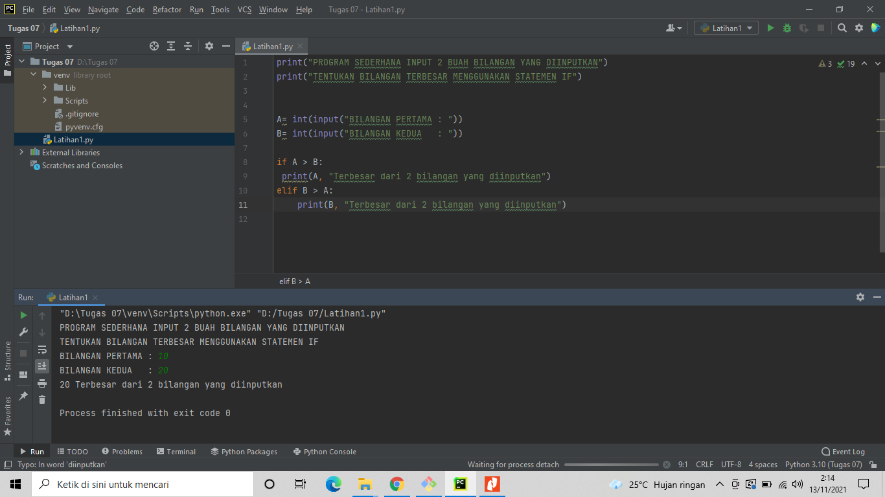
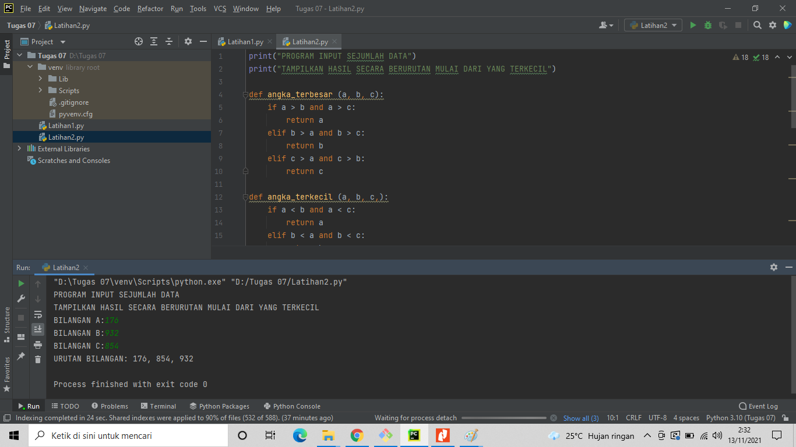
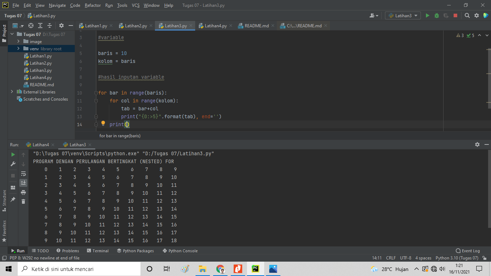
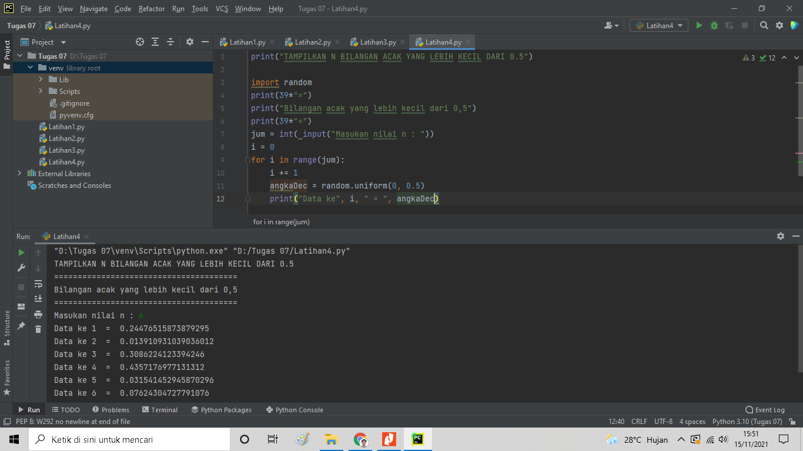

# TUGAS 07 KONDISIONAL DAN PERULANGAN

Kabul Ramadhan | 311810315 | TI.18.B2 | Bahasa Pemrograman

#Latihan1.py
## Membuat Program Sederhana Menampilkan Bilangan Terbesar dari Dua  Bilah Bilangan Menggunakan Statemen If

Pada perintah tersebut hanya ada dua kondisi, Yaitu jika nilai yang diinputkan A > B maka nilai A terbesar dari dua
bilangan yang diinputkan, Begitupun sebaliknya.

### Struktur Algoritma :

1. Start
2. Gunakan inisial A & B 
3. Read A
4. Read B
5. if A > B
6. Cetak 'A Terbesar dari 2 bilangan yang di inputkan'
7. elif B > A
8. Cetak 'B Terbesar dari 2 bilangan yang diinputkan'
9. Cetak nilai terbesar yang diinputkan
10. Stop

### Code & Hasil :



***
***

# Latihan2.py
## Program Mengurutkan Hasil Dari Yang Terkecil

Pada perintah tersebut mencari nilai terbesar, nilai tengah, dan nilai terkecil, kemudian menampilkan urutan nilai yang
terkecil dari 3 variable yang diinputkan

### Struktur Algoritma :

1. Start
2. Gunakan inisial A, B, C
3. Nilai Terbesar
* if A > B and A > C: return A
* elif B > A and B > C: return B
* elif C > A and C > B: return C
4. Nilai Terkecil
* if A < B and A < C: return A
* elif B < A and B < C: return B
* elif C < A and C < B: return C
5. Nilai Tengah
* if (B > A > C) or (C > A > B): return A
* elif (A > B > C) or (C > B > A): return B
* elif (A > C > B) or (B > C > A): return C
6. Read A
7. Read B
8. Read C
9. Cetak urutan bilangan dari yang terkecil
10. Stop

### Code & Hasil :


***
***

# Latihan3.py
## Program Perulangan Bertingkat (Nested) For

### Penjelasan

1. Pendeklerasian Variable

```python
baris = 10
kolom = baris
```

2. Untuk perulangan baris dan kolom menggunakan `nested for`
```python
for bar in range(baris):
    for col in range(kolom):
        tab = bar+col        
```

3. Untuk menampikan hasil dari perulangan
     * Agar terlihat rapih menggunakan `format string` rata ke kanan sebanyak 5 karakter
     * Agar tidak membuat baris baru menggunakan `end=''` (baris)
     * Penggunaan `print()` untuk membuat baris baru (kolom)
```python
  print("{0:>5}".format(tab), end='')
print()    
```

4. Hasil Program


***
***

# Latihan4.py
## Program Menampilkan N Bilangan Acak Yang Lebih Kecil Dari 0.5

### Penjelasan

1. Mengimport module `random` untuk membuat bilangan acak
```python
import random
```

2. Untuk menentukan jumlah input yang diinginkan dan dikonversi ke dalam bilangan bulat (integer) yang dimasukan ke variable `jum`
```python
jum = int( input("Masukan nilai n : "))
```

3. Untuk pengulangan range yang diinputkan oleh variable `jum`
```python
for i in range(jum):
```

4. Untuk menampilkan urutan data sesuai jumlah inputan dengan hasil di bawah 0.5
```python
angkaDec = random.uniform(0, 0.5)
    print("Data ke", i, " = ", angkaDec)
```

5. Hasil Program

